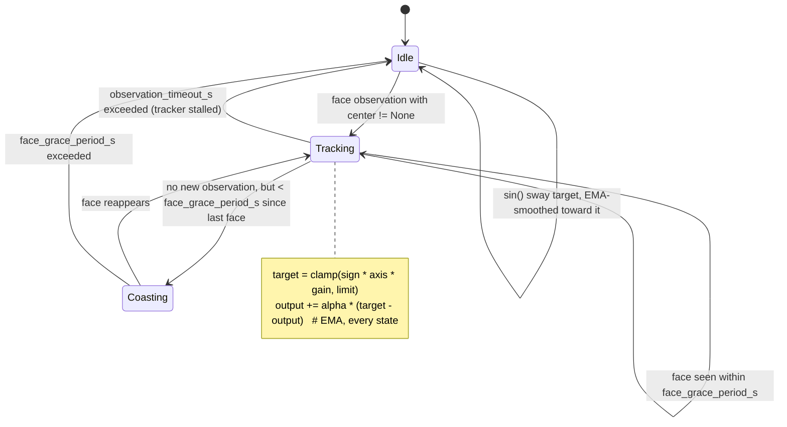
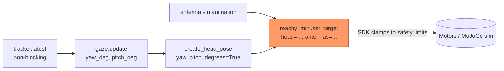

## 1. Perception layer

`apps/social_app/social_app/perception.py`'s `WebcamFaceTracker` runs webcam
capture and face detection on a background thread, decoupled from the
50Hz control loop that consumes its output.

**Why a background thread.** `cv2.VideoCapture.read()` blocks for the
duration of a frame grab, which is incompatible with a fixed-rate control
loop that also has to call `set_target()` on schedule. Running capture +
detect on its own thread, paced to `target_fps` independently of the
control loop's rate, keeps the control loop free to run at its own cadence
without waiting on camera I/O.

**Why `SimpleQueue` + `latest()`.** The background thread publishes each
tick's result (a `FaceObservation`) into a `queue.SimpleQueue`. The control
loop reads via `latest()`, which drains the entire queue and returns only
the most recent item (or `None` if nothing new arrived since the last
call). This is a non-blocking, most-recent-wins snapshot read: the control
loop never blocks waiting for a new observation, and it never falls behind
processing stale backlog if it happens to poll less often than the
detector produces frames.

**Reused SDK internals.** Two pieces are reused from `reachy_mini.vision.*`
rather than reimplemented, despite being undocumented, private-ish
internals of the SDK's own camera pipeline:

- `reachy_mini.vision.face_detector.FaceDetector` — a YuNet ONNX face
  detector (model auto-downloads from the HF Hub on first construction,
  then caches locally; pinned to 1 CPU thread internally).
- `reachy_mini.vision.face_tracking.Tracker` — hysteresis-based single-face
  selection across frames via `Tracker.select(faces, width, height)`.

The one piece intentionally *not* reused is the private `_center` helper;
`_normalized_center` reimplements that math locally so the app doesn't
depend on an SDK private symbol across upgrades.

**Normalization math.** `_normalized_center(face, width, height)` maps the
detected face's nose keypoint to a `[-1, 1]` range independent of capture
resolution:

```python
(
    face.nose[0] / max(width - 1, 1) * 2 - 1,
    face.nose[1] / max(height - 1, 1) * 2 - 1,
)
```

### Sequence diagram

Verified against `apps/social_app/social_app/perception.py`'s `_run`
(lines 103–149): each tick calls `cap.read()`, then
`detector.detect(frame_bgr)`, then `tracker.select(faces, width, height)`,
then (if a face was selected) `_normalized_center(...)`, then
`self._observations.put(FaceObservation(...))`. The control loop's
`latest()` call happens independently, on its own cadence, and simply
drains whatever is queued.

```mermaid
sequenceDiagram
    participant Cap as cv2.VideoCapture
    participant Det as FaceDetector (YuNet)
    participant Trk as Tracker (hysteresis)
    participant Q as SimpleQueue
    participant Loop as Control loop (50Hz)

    loop every 1/target_fps s (background thread)
        Cap->>Det: frame_bgr
        Det->>Trk: list[Face]
        Trk->>Trk: select() best face (area/jump/misses gating)
        Trk-->>Q: FaceObservation(center, timestamp)
    end
    Loop->>Q: latest() [non-blocking, drains backlog]
    Q-->>Loop: FaceObservation | None
```

### Tunable constants

| Constant | Guards against |
|---|---|
| `camera_index` | Selecting the wrong physical camera when multiple are attached. |
| `target_fps` | Runaway CPU use / unnecessary detector load — paces the background thread's capture+detect rate independently of the control loop's rate. |
| `min_area_frac` | Spurious detections of faces too small/far away to be a meaningful gaze target. |
| `max_jump` | Implausible frame-to-frame teleports (e.g. detector jumping to a different face or a false positive) being accepted as continuous tracking. |
| `max_misses` | Dropping the tracked face too eagerly on a handful of missed detections (blinks, brief occlusion, a bad frame) — tolerates up to N consecutive misses before giving up. |

## 2. Gaze smoothing (pure function, I/O-free)

`apps/social_app/social_app/gaze.py`'s `GazeController.update()`
(`gaze.py:48-87`) turns the latest `FaceObservation` into a smoothed
`(yaw_deg, pitch_deg)` head-pose target, once per control-loop tick.

**Why no I/O dependencies.** `GazeController` takes no camera, queue, or
robot handle — just a `FaceObservation | None` and a timestamp in, a pose
tuple out. This is deliberate: it lets a future or different control loop
call the same `update()` without extracting or rewriting the logic. That
reuse already happened once — `apps/companion/gaze_move.py`'s `GazeMove`
consumes `GazeController` directly rather than reimplementing smoothing, per
`apps/social_app/plan.md` lines 105-113 (phase 1's `gaze.py`/`perception.py`
were "deliberately built I/O-decoupled... specifically so this merge is
additive, not a rewrite") and lines 126-127 (confirming the resolution:
"Open decision 1 above (gaze/conversation-loop merge) is resolved by
`apps/companion/gaze_move.py`'s `GazeMove`").

**Two independent timeout tiers.** `update()` tracks two separate
timestamps — `_last_observation_at` (any tick from the tracker thread,
face found or not) and `_last_face_seen_at` (last tick where a face was
actually found) — and gates on two separate durations:

- `face_grace_period_s = 0.4` — coast through a single dropped detector
  frame (a blink, a bad frame) without snapping the target to idle sway.
- `observation_timeout_s = 1.0` — a longer, coarser check for the tracker
  *thread* itself being stalled or dead (no ticks at all, not just no
  face).

These are different failure modes on purpose: a momentary "face not found
this frame" and "the background thread stopped producing observations
entirely" need different tolerances, so they get independent timers rather
than one shared one.

**Idle-sway fallback.** When either timer condition fails —
`tracker_alive` is false or `face_recently_seen` is false — the target
becomes a slow `sin()` wave (`idle_amplitude_deg`, `idle_period_s`) instead
of a fixed pose. This is what stops the head locking into a static position
when no one is present; per `plan.md`, `apps/social_app`'s Environment/
Status notes independently confirm this behavior was visually verified
against a real face in the MuJoCo viewer.

**EMA runs unconditionally, after target selection.** Verified directly
against `gaze.py:56-87`: target selection (real face target vs. idle sway
target) happens first and is branched — `if tracker_alive and
face_recently_seen: target_yaw, target_pitch = ...; else: target_yaw =
idle sin(...), target_pitch = 0.0`. But the EMA update —

```python
self._yaw_deg += cfg.smoothing_alpha * (target_yaw - self._yaw_deg)
self._pitch_deg += cfg.smoothing_alpha * (target_pitch - self._pitch_deg)
```

— sits *after* that `if`/`else` block, at the same indentation level, and
runs every single call regardless of which branch produced `target_yaw`/
`target_pitch`. `smoothing_alpha = 0.25` is applied uniformly whether the
target came from a real face or from idle sway, which is exactly why
tracking-to-idle transitions don't visibly jump — the same low-pass filter
smooths across the state boundary, not just within a state.

**Portability warning — flagged prominently, not buried.** `yaw_sign` and
`pitch_sign` in `GazeConfig` are explicitly *not analytically solvable*:
per `apps/social_app/plan.md` lines 60-64, "there's no calibration between
an arbitrary laptop webcam and the robot's coordinate frame" — the correct
sign depends on the physical/simulated camera and joint coordinate
conventions and can only be determined by observing which way the head
turns in the sim viewer and flipping the sign if it's backwards. **This is
the single most important portability note for a Franka/RealSense port**:
expect to re-derive `yaw_sign`/`pitch_sign` (and re-tune `yaw_gain_deg`/
`pitch_gain_deg`) empirically against the new camera/arm frame — there is
no formula to carry over, only the tuning procedure.

### State diagram

Verified against `gaze.py:68-86`: `tracker_alive` (derived from
`_last_observation_at` vs. `observation_timeout_s`) and `face_recently_seen`
(derived from `_last_face_seen_at` vs. `face_grace_period_s`) are exactly
the two conditions gating tracked-vs-idle target selection, combined with
`and`. The EMA line runs unconditionally after target selection, not inside
either branch — confirmed by re-reading `gaze.py:77-86` above.



## 3. Control loop integration

`apps/social_app/social_app/main.py:52-88` runs a fixed-rate 50Hz loop
(`LOOP_HZ = 50.0`) that fuses gaze and antenna animation state into a
single per-tick call to `reachy_mini.set_target()`.

**Drift-free timing.** The loop tracks a `next_tick` accumulator
(`next_tick = time.monotonic()` before the loop, `next_tick +=
LOOP_PERIOD_S` after each tick) rather than sleeping a naive `1/hz` each
iteration. `sleep_for = next_tick - time.monotonic()` is computed fresh
every tick, so any time spent doing work (tracker read, gaze update, the
`set_target` call itself) is subtracted from the next sleep rather than
silently accumulating drift; if the loop falls behind entirely (`sleep_for
<= 0`), `next_tick` is reset to `time.monotonic()` rather than trying to
catch up by busy-looping through missed ticks.

**Per-tick sequence, verified directly against `main.py:59-79`:**

1. `tracker.latest()` — non-blocking read of the most recent
   `FaceObservation` from the background perception thread (section 1).
2. `gaze.update(obs, now)` — pure smoothing function (section 2), returns
   `(yaw_deg, pitch_deg)`.
3. `create_head_pose(yaw=yaw_deg, pitch=pitch_deg, degrees=True)` →
   `head_pose`.
4. Independently, antenna animation state is computed each tick from a
   `sin()` wave (or zeros if disabled) → `antennas_deg` → `antennas_rad`.
5. Both `head_pose` (step 3) and `antennas_rad` (step 4) are fully computed
   *before* the single call: `reachy_mini.set_target(head=head_pose,
   antennas=antennas_rad)` at `main.py:76-79`.

**Verification note.** Re-checked `main.py:59-79` directly: there is
exactly one `set_target()` call in the loop body (line 76), and both of its
arguments (`head_pose`, computed at line 60; `antennas_rad`, computed at
line 74) are assigned before that call — not two separate calls, and
nothing after the call feeds back into it that tick. The Mermaid flowchart
below matches this.



**The upstream "one `set_target()` call site" rule.** Per
`docs/reachy_mini_notes.md:34-39`: `goto_target(...)` is for smooth,
≥0.5s interpolated moves; `set_target(...)` is for real-time/high-frequency
control (tracking, games, 10Hz+ loops), controlling `head` (6DOF Stewart
platform pose), `antennas` (2 motors), and `body_yaw`. The architectural
consequence — stated identically in `apps/social_app/plan.md:31-33` ("so
there's exactly one `set_target()` call site in the whole app (per the
SDK's own `control-loops.md` rule)") — is that **an app should have exactly
one `set_target()` call site**, so that multiple behavior sources (gaze,
idle animation, and in a future phase, conversation-driven moves) don't
fight over the motor target on the same tick. They must instead be fused
into a single pose/antenna-array pair before that one call, which is
exactly why `gaze.py`'s `GazeController.update()` is a pure function
returning a value rather than owning any I/O or calling `set_target`
itself (section 2) — it composes into whatever single call site the host
loop provides, rather than competing for one of its own.

**Safety clamps (SDK-enforced, independent of app logic).** Per
`docs/reachy_mini_notes.md:38`: head pitch/roll ±40°, head yaw ±180°, body
yaw ±160°, head-vs-body yaw delta ≤65°. These are applied by the daemon/SDK
itself regardless of what `main.py` computes and sends — the app cannot
bypass them by construction. This matters for a future Franka/RealSense
port: Franka's arm has 7 revolute joints and no equivalent "head" pose
abstraction, so these specific numbers don't transfer at all. What *does*
transfer is the concept — a hard, SDK/driver-enforced joint-limit clamp
applied after whatever the control loop computes, independent of and
downstream from app-level smoothing logic — which will need to be
re-derived from Franka's own joint limits (e.g. via its controller's
safety/limit configuration) rather than assumed away.
