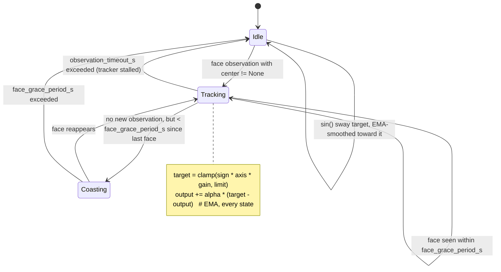
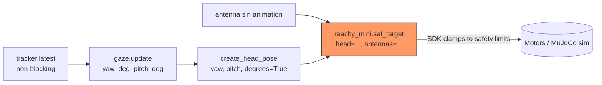
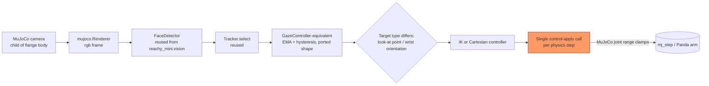

# Franka + RealSense Eye-Gaze Research Plan

> **For agentic workers:** REQUIRED SUB-SKILL: Use superpowers:subagent-driven-development (recommended) or superpowers:executing-plans to implement this plan task-by-task. Steps use checkbox (`- [ ]`) syntax for tracking.

**Goal:** Produce `docs/franka_realsense_gaze_findings.md` — a findings document, with Mermaid diagrams, that explains exactly how Reachy Mini's gaze/attention pipeline works and evaluates what's portable to a RealSense-camera-on-Franka-hand (eye-in-hand) setup in MuJoCo.

**Architecture:** This is a research spike, not a code change. Each task below is an investigation step that produces one section of the findings document by reading and citing existing source (`apps/social_app/social_app/{perception,gaze,main}.py`, `docs/reachy_mini_notes.md`) plus external research on Franka MuJoCo models and RealSense-in-MuJoCo simulation. No application code is created or modified; the only artifact this plan produces is the findings markdown file (and this plan file itself).

**Tech Stack:** Markdown + Mermaid (diagrams render natively in most viewers incl. GitHub and Claude Artifacts). No new dependencies, no code.

**Spec:** none (spike — brainstorming concluded with direct approval, no separate spec doc per the spike path).

## Global Constraints

- No changes to `apps/social_app` or `apps/companion` code — read-only research.
- All claims in the findings doc must cite a specific file/line from this repo or a named external source (Franka MuJoCo Menagerie, Intel RealSense docs, MuJoCo docs) — no unverified assertions.
- Work happens entirely on branch `research/franka-realsense-gaze`; nothing here targets `main` or the AI-brain-memory branch.
- Deliverable path: `docs/franka_realsense_gaze_findings.md`.

---

### Task 1: Document the perception layer (webcam → face detection)

**Files:**
- Read: `apps/social_app/social_app/perception.py` (already read in full — `WebcamFaceTracker`, `FaceObservation`, `_normalized_center`)
- Create: findings doc section `## 1. Perception layer` in `docs/franka_realsense_gaze_findings.md`

**Interfaces:**
- Produces: a Mermaid sequence diagram of the background-thread capture loop (`cv2.VideoCapture` → `FaceDetector.detect()` → `Tracker.select()` → normalized-center → `SimpleQueue`), and a short table of the tunable constants (`camera_index`, `target_fps`, `min_area_frac`, `max_jump`, `max_misses`) with what each guards against.

- [ ] **Step 1: Write the section**

Cover: background-thread architecture (why a thread — `cv2.VideoCapture.read()` blocks; why `SimpleQueue` + `latest()` drain pattern — non-blocking snapshot read for the 50Hz control loop, most-recent-wins semantics), the reuse of `reachy_mini.vision.face_detector.FaceDetector` (YuNet ONNX) and `reachy_mini.vision.face_tracking.Tracker` (hysteresis-based single-face selection: `min_area_frac` rejects tiny/far detections, `max_jump` rejects implausible frame-to-frame teleports, `max_misses` tolerates N missed frames before dropping the tracked face) as undocumented-but-reused SDK internals, and the normalization math in `_normalized_center` (nose keypoint → `[-1, 1]` range independent of resolution).

Include this Mermaid sequence diagram (verify against the actual code before pasting into the doc — don't hand-wave the loop order):

```mermaid
sequenceDiagram
    participant Cap as cv2.VideoCapture
    participant Det as FaceDetector (YuNet)
    participant Trk as Tracker (hysteresis)
    participant Q as SimpleQueue
    participant Loop as Control loop (50Hz)

    loop every 1/target_fps s (background thread)
        Cap->>Det: frame_bgr
        Det->>Trk: list[Face]
        Trk->>Trk: select() best face (area/jump/misses gating)
        Trk-->>Q: FaceObservation(center, timestamp)
    end
    Loop->>Q: latest() [non-blocking, drains backlog]
    Q-->>Loop: FaceObservation | None
```

- [ ] **Step 2: Verify diagram against source**

Re-open `apps/social_app/social_app/perception.py` lines 103-149 (`_run`) and confirm the diagram's message order matches `cap.read()` → `detector.detect(frame_bgr)` → `tracker.select(...)` → `_normalized_center(...)` → `self._observations.put(...)`. Fix the diagram if it drifts.

- [ ] **Step 3: Commit**

```bash
git add docs/franka_realsense_gaze_findings.md
git commit -m "research: document Reachy perception layer"
```

---

### Task 2: Document the gaze smoothing/control math

**Files:**
- Read: `apps/social_app/social_app/gaze.py` (already read in full — `GazeConfig`, `GazeController.update`)
- Modify: `docs/franka_realsense_gaze_findings.md` — add `## 2. Gaze smoothing (pure function, I/O-free)`

**Interfaces:**
- Consumes: `FaceObservation` shape from Task 1 (`center: tuple[float,float]|None`, `timestamp: float`)
- Produces: a Mermaid state diagram of the three-state behavior (`tracking` / `coasting through grace period` / `idle sway`), and a written explanation of the EMA smoothing and the two-timer hysteresis (`face_grace_period_s` vs `observation_timeout_s`).

- [ ] **Step 1: Write the section**

Explain, citing `apps/social_app/social_app/gaze.py:48-87`:
- Why `GazeController` takes no I/O dependencies (deliberate — reusable from a future/different control loop, confirmed by `apps/companion/gaze_move.py`'s `GazeMove` doing exactly that reuse, per `apps/social_app/plan.md` lines 105-113 and 126-127).
- The two independent timeout tiers: `face_grace_period_s=0.4` (coast through a single dropped detector frame without snapping to idle) vs `observation_timeout_s=1.0` (tracker thread considered dead — a longer, coarser check). Two tiers because "face briefly not detected" and "tracker thread stalled" are different failure modes needing different tolerances.
- The idle-sway fallback: a `sin()` wave over `idle_period_s` when neither timer condition holds — this is what stops the head snapping to a fixed pose when no one is present.
- The EMA (`smoothing_alpha=0.25`) applied *after* target selection, uniformly whether the target came from a real face or the idle sway — this is why transitions between tracking and idle don't visibly jump.
- The `yaw_sign`/`pitch_sign` config fields explicitly documented as *not analytically solvable* (`apps/social_app/plan.md` line 61-64) — they depend on the physical/simulated coordinate frame and must be tuned empirically per platform. **This is the single most important portability note for the Franka port** — flag it prominently, don't bury it.



- [ ] **Step 2: Verify diagram against source**

Re-check `apps/social_app/social_app/gaze.py:68-86` — confirm `tracker_alive` and `face_recently_seen` are the two conditions gating tracked-vs-idle target selection, and that the EMA line (`self._yaw_deg += cfg.smoothing_alpha * (target_yaw - self._yaw_deg)`) runs unconditionally after target selection (not only in one branch). Fix the diagram/notes if it drifts.

- [ ] **Step 3: Commit**

```bash
git add docs/franka_realsense_gaze_findings.md
git commit -m "research: document Reachy gaze smoothing/hysteresis"
```

---

### Task 3: Document the control-loop integration and the "one set_target() call" rule

**Files:**
- Read: `apps/social_app/social_app/main.py` (already read in full), `docs/reachy_mini_notes.md` (Motion section, lines 34-39)
- Modify: `docs/franka_realsense_gaze_findings.md` — add `## 3. Control loop integration`

**Interfaces:**
- Consumes: `(yaw_deg, pitch_deg)` from Task 2's `GazeController.update()`
- Produces: a Mermaid flowchart of one 50Hz tick, and an explicit note on the SDK-enforced architectural rule ("exactly one `set_target()` call site per app").

- [ ] **Step 1: Write the section**

Explain, citing `apps/social_app/social_app/main.py:52-88`:
- The fixed-rate loop (`LOOP_HZ = 50.0`, drift-free via `next_tick += LOOP_PERIOD_S` / `time.monotonic()` accounting, not naive `time.sleep(1/hz)`).
- Per tick: `tracker.latest()` (non-blocking read) → `gaze.update(obs, now)` → `create_head_pose(yaw=..., pitch=..., degrees=True)` → merged with antenna animation state → the single `reachy_mini.set_target(head=..., antennas=...)` call.
- The upstream SDK rule this obeys (`docs/reachy_mini_notes.md:34-39`, also stated in `apps/social_app/plan.md:31-33`): `set_target()` is for real-time/high-frequency control (10Hz+), `goto_target()` is for smooth ≥0.5s interpolated moves; **an app should have exactly one `set_target()` call site** so multiple behavior sources (gaze, idle animation, future conversation-driven moves) don't fight over the motor target each tick — they must be fused into one pose before the single call, which is exactly why `gaze.py` is a pure function returning a value rather than owning any I/O.
- The safety clamps applied by the SDK itself regardless of what this app computes (`docs/reachy_mini_notes.md:38`): head pitch/roll ±40°, yaw ±180°, body yaw ±160°, head-vs-body yaw delta ≤65° — relevant later because Franka's joint limits are a completely different shape (7 revolute joints, no equivalent "head" abstraction) and this safety-clamp *concept*, not the numbers, is what has to be re-derived for Franka.



- [ ] **Step 2: Verify diagram against source**

Re-check `apps/social_app/social_app/main.py:59-79` — confirm `set_target` is called exactly once per loop iteration and that both `head_pose` and `antennas_rad` are computed before that single call (not two separate calls). Fix the diagram if it drifts.

- [ ] **Step 3: Commit**

```bash
git add docs/franka_realsense_gaze_findings.md
git commit -m "research: document Reachy control loop and set_target() rule"
```

---

### Task 4: Research Franka + RealSense eye-in-hand in MuJoCo

**Files:**
- Modify: `docs/franka_realsense_gaze_findings.md` — add `## 4. Franka + RealSense (eye-in-hand) in MuJoCo — feasibility research`

**Interfaces:**
- Consumes: nothing from prior tasks (external research), but the writeup must explicitly map each Reachy concept from Tasks 1-3 to its Franka equivalent (or explain why there is none).
- Produces: a comparison table + a Mermaid flowchart mirroring Task 3's diagram but for the Franka case, plus a named list of open questions that need hands-on validation (not analytically resolvable from docs alone — same honesty standard as `apps/social_app/plan.md`'s `yaw_sign`/`pitch_sign` note).

- [ ] **Step 1: Research and write, covering:**

1. **Franka MuJoCo model source**: MuJoCo Menagerie's `franka_emika_panda` (or `franka_fr3`) model — confirm current filenames/joint names by checking the actual MJCF once the model is vendored into this repo (do not guess joint names from memory in the findings doc; mark as "verify against vendored XML" if not yet pulled in).
2. **Camera-in-hand attachment**: MuJoCo supports a `<camera>` element as a child of any body in the MJCF — attaching one to the Panda's end-effector/flange body gives an eye-in-hand camera whose pose follows the arm kinematically, no separate mount modeling needed beyond specifying the camera's local offset/orientation relative to that body. This directly substitutes for a real RealSense's extrinsics (the fixed transform from the camera's optical frame to the gripper mounting point) — that transform must be measured or taken from Intel's RealSense CAD/datasheet for the specific model (D405 is the common wrist-mount choice for its short minimum depth range) and hand-coded as the `<camera pos=... quat=...>` offset.
3. **Face/attention-target detection with a simulated camera**: MuJoCo's rendered camera feed (via `mujoco.Renderer` / the Python bindings) can be piped into the *same* `reachy_mini.vision.face_detector.FaceDetector` (YuNet ONNX, general-purpose, not Reachy-specific) used in Task 1 — the detector doesn't care that the frame came from a simulated camera instead of `cv2.VideoCapture`. Reuse candidate; new work is only the frame-source adapter, not the detection logic. Note: unlike `social_app`'s design (webcam sees the real user because there's no human in the MuJoCo scene, per `perception.py`'s module docstring lines 6-8), a Franka simulation *can* place a synthetic human/face asset in-scene since the eye-in-hand camera renders the MuJoCo world itself — this is a meaningful design fork from Reachy's approach, not just a swap.
4. **Control-loop equivalent**: Franka has no "head pose" abstraction — the target is end-effector Cartesian pose or joint angles. Porting `gaze.py`'s *shape* (pure smoothing function, EMA + two-tier hysteresis + idle fallback, returning a target) is straightforward; what changes is what the target *is* (a wrist orientation, or a look-at point converted to IK, rather than yaw/pitch of a 2-DOF-ish head) and what applies it (a MuJoCo `mj_step` position/velocity actuator command loop instead of `set_target()`). The "exactly one control call site" discipline from Task 3 still applies and is worth carrying over verbatim — it's a general good-practice constraint, not Reachy-specific.
5. **Safety-limit equivalent**: Franka Panda's real joint limits and MuJoCo's own `<joint range=...>` clamps (enforced by the physics engine directly, unlike Reachy's SDK-side software clamp) are the equivalent of the ±40°/±180°/±160° numbers in Task 3 — same concept (bound the commanded target before/at the point of physical actuation), different mechanism (engine-level joint limits vs. SDK-level pose clamp) and different numbers (must be read from the vendored Menagerie MJCF, not guessed).



2. **Comparison table** (Reachy vs. Franka+RealSense-in-hand):

| Concept | Reachy Mini (`social_app`) | Franka + RealSense eye-in-hand |
|---|---|---|
| Camera source | Real laptop webcam (`cv2.VideoCapture`) — no human in MuJoCo scene | MuJoCo-rendered camera child of end-effector body — scene *can* contain a synthetic face |
| Detection | `reachy_mini.vision.face_detector.FaceDetector` (YuNet) | Same library reusable as-is; new frame-source adapter only |
| Target representation | Head yaw/pitch (deg) | End-effector Cartesian pose or wrist orientation → needs IK |
| Smoothing | EMA + two-tier hysteresis (`gaze.py`) | Same *shape* portable; target type changes |
| Actuation call | `reachy_mini.set_target()`, exactly one call site | Position/velocity actuator command via `mj_step`, same one-call-site discipline recommended |
| Safety clamping | SDK-side software clamp (fixed degrees) | MuJoCo `<joint range>` engine-level clamp, values from vendored MJCF |
| Sign/gain tuning | Empirical, platform-specific (`yaw_sign`/`pitch_sign`), not analytically solvable | Expect the same category of empirical tuning step for the look-at→IK mapping |

- [ ] **Step 2: List explicit open questions** (do not resolve them — flag for hands-on spike):
  - Exact Menagerie model/filename and flange body name to attach the camera to (needs the model vendored and opened, not guessed).
  - Whether `mujoco.Renderer`-based per-tick rendering can sustain the detector's needed frame rate without starving the physics step loop.
  - Which RealSense model's real extrinsics/FOV to mirror (D405 vs D435i) for realism if this ever needs to match real hardware later.
  - IK solver choice for converting a look-at target into a joint/Cartesian command (out of scope for this research doc — a separate spike).

- [ ] **Step 3: Commit**

```bash
git add docs/franka_realsense_gaze_findings.md
git commit -m "research: Franka+RealSense eye-in-hand feasibility and comparison"
```

---

### Task 5: Finalize findings doc (intro, summary, recommendation)

**Files:**
- Modify: `docs/franka_realsense_gaze_findings.md` — add `## Summary` and a short intro at the top (before `## 1. Perception layer`)

**Interfaces:**
- Consumes: sections written in Tasks 1-4.
- Produces: the complete, standalone findings document.

- [ ] **Step 1: Write intro**

One paragraph: purpose of the doc, scope (Reachy's gaze pipeline traced from source, Franka+RealSense feasibility researched, no code written), and a pointer back to this plan file and the branch it lives on.

- [ ] **Step 2: Write summary/recommendation**

Bullet list: what's directly reusable (face detector library, smoothing/hysteresis *shape*, one-control-call-site discipline), what must be rebuilt (target representation + IK, actuation call, safety clamp values), and what's genuinely open (frame-source adapter perf, exact Menagerie model details) — each tagged back to the section that supports it.

- [ ] **Step 3: Read the whole doc top to bottom once**

Confirm section numbering is consistent, all Mermaid blocks are syntactically closed, and every claim has a citation (file:line or named external source per the Global Constraints rule above). Fix anything that reads like a placeholder.

- [ ] **Step 4: Commit**

```bash
git add docs/franka_realsense_gaze_findings.md
git commit -m "research: finalize Franka+RealSense gaze findings doc"
```

---

## Self-Review Notes

- **Spec coverage**: N/A (spike, no separate spec) — this plan's own scope (trace Reachy pipeline with diagrams, research Franka portability) is fully covered by Tasks 1-5.
- **Placeholder scan**: no TBD/TODO — Task 4's "open questions" are deliberately flagged as open (matching this repo's existing convention of `yaw_sign`/`pitch_sign` in `apps/social_app/plan.md`), not placeholders for missing plan content.
- **Type consistency**: N/A (no code).
- Diagrams in Tasks 1-3 are provisional pending each task's own "verify against source" step — intentional, since they were drafted from a single read-through and must be checked line-by-line before being committed to the findings doc.
