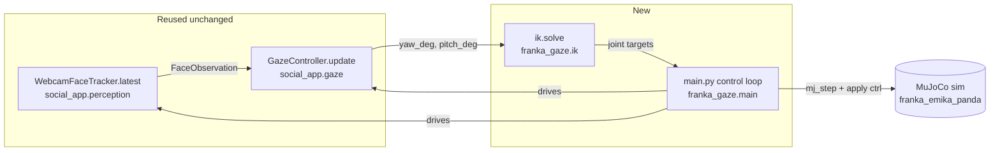

# Franka Gaze Prototype — Design Spec

**Status:** approved via brainstorming session (chat-based design walkthrough,
approved by proceeding directly to plan-writing). Branch:
`research/franka-realsense-gaze` was the research spike this design follows
from — implementation happens on a new branch off `main`, per this repo's
CLAUDE.md workflow rule (never implement directly on `main`).

## Problem

`docs/franka_realsense_gaze_findings.md` researched porting Reachy Mini's
webcam-driven gaze/attention behavior to a Franka Panda arm. Section 5 of
that doc settles on a narrower, buildable approach: keep the camera
world-fixed (as Reachy already does) and make the Franka end-effector orient
toward the detected face, instead of attempting a true eye-in-hand rig. This
spec designs that system.

## Goals

- Reuse Reachy's existing, working perception (`WebcamFaceTracker`) and
  gaze-smoothing (`GazeController`) code unchanged.
- Add only the new piece: converting a smoothed yaw/pitch angle pair into a
  Franka end-effector orientation via IK, and driving a MuJoCo simulation
  with it.
- Prove the concept visually: a human moves in front of the webcam, the
  simulated Franka arm's end-effector visibly, smoothly orients toward them
  in the MuJoCo viewer.

## Non-goals

- No physical hardware — MuJoCo simulation only, matching this repo's
  existing sim-only precedent for `apps/social_app`.
- No true eye-in-hand (RealSense mounted on the flange) — that requires
  visual-servoing control-loop rework, explicitly deferred per finding §4
  point 4 / §5 of the research doc.
- No synthetic face detection in MuJoCo's rendered camera feed — the camera
  is a real, world-fixed laptop webcam.
- No numeric tracking-accuracy benchmarks for this first pass — success is
  visual/qualitative, matching `apps/social_app`'s own stated bar
  ("legibility... and general robustness", `apps/social_app/plan.md`).

## Architecture

A new top-level project, `franka_gaze/`, sibling to `apps/` — NOT scaffolded
via `reachy-mini-app-assistant` (that tool is Reachy-daemon-specific and has
no Franka/MuJoCo-standalone equivalent). `franka_gaze/` is a standalone
Python package installed editable into the repo's shared `.venv`, driving
MuJoCo directly rather than through any daemon/app framework — Franka has no
daemon in this repo, so the closest analogue to `run_sim.ps1` is a plain
script that opens `mujoco.viewer.launch_passive()` itself.

### Components

- **`franka_gaze/models/`** — vendored `franka_emika_panda` MJCF and mesh
  assets from [MuJoCo Menagerie](https://github.com/google-deepmind/mujoco_menagerie)
  (Apache-2.0 licensed; license file copied alongside per Menagerie's own
  terms).
- **`franka_gaze/franka_gaze/ik.py`** — pure function module, no I/O, no
  MuJoCo `viewer`/rendering dependency at import time beyond the `mujoco`
  package itself (needed for `MjModel`/`MjData`/Jacobian calls). Converts
  `(yaw_deg, pitch_deg)` into target joint angles via damped-least-squares
  differential IK, using a fixed nominal look-at distance in front of the
  end-effector's home pose (there is no depth signal from a monocular
  webcam, so — like Reachy's own angular gain mapping — this is an angular
  target, not a 3D position estimate).
- **`franka_gaze/franka_gaze/main.py`** — the control loop and the sole
  MuJoCo `mj_step` + control-application call site (mirrors
  `apps/social_app/social_app/main.py`'s "exactly one `set_target()` call"
  discipline, adapted to MuJoCo's own actuator-control API). Fixed-rate
  loop, `mujoco.viewer.launch_passive()` for the GUI window.
- **`franka_gaze/pyproject.toml`** — editable-installable package, depends
  on `social_app` (path/editable dependency within the same repo — social_app
  is already installed editable into the shared `.venv`, so `franka_gaze`
  imports `social_app.perception`/`social_app.gaze` directly) and `mujoco`.
- **`franka_gaze/plan.md`** — this repo's existing convention (see
  `apps/social_app/plan.md`) of a plan file living with the app/prototype
  it documents; written before implementation, updated as decisions are made.

### Data flow

Identical shape to Reachy's existing loop
(`apps/social_app/social_app/main.py`), with one new stage appended:

`WebcamFaceTracker.latest()` → `GazeController.update()` →
`(yaw_deg, pitch_deg)` → **`ik.solve(yaw_deg, pitch_deg, current_qpos)`** →
joint targets → single `mj_step`-driving call.

### Error handling

IK failure (non-convergence, near-singularity) holds the last successfully
computed joint target rather than snapping to an undefined pose — this
mirrors `GazeController`'s own "coast through gaps, don't jump" philosophy
(the two-tier hysteresis in `gaze.py`) rather than introducing a new failure
pattern into the pipeline.

### Testing

No physical hardware to test against, matching `apps/social_app`'s own
precedent (sim-only, "visually confirmed working" as the bar, not a
hardware-in-the-loop suite). Two tiers:

1. **Automated, `ik.py` only**: pure-function unit tests — given known
   `(yaw_deg, pitch_deg)` inputs and a known starting `qpos`, the solver
   converges (residual error below a tolerance), the joints stay inside the
   model's own `<joint range>` limits, and no NaNs appear in the output.
   This is the one place in the system with enough determinism for
   meaningful automated tests.
2. **Manual, whole-system**: run `franka_gaze/franka_gaze/main.py`, move in
   front of the webcam, visually confirm the end-effector orients toward
   you smoothly, without jitter or wild motion — the same bar
   `apps/social_app`'s phase 1 was held to and passed.

## Open items carried from the research doc (still open, not blocking this plan)

- IK solver robustness beyond MuJoCo's built-in differential IK (e.g.
  `mink`) — deferred; built-in Jacobian-based IK is the chosen starting
  point (see design discussion), can be swapped later behind `ik.py`'s
  same function signature if it proves insufficient.
- Self-collision and singularity avoidance — MuJoCo's own collision
  detection runs regardless during `mj_step`; this plan does not add
  additional active avoidance logic beyond joint-limit clamping. Flagged
  as a known gap, not solved here.
- Idle-sway-on-an-arm safety framing (research doc §4's open questions) —
  this plan's first milestone only implements face-tracking, not the idle
  fallback behavior; `GazeController`'s idle sway will still fire when no
  face is seen (it's baked into `gaze.py`), so the arm *will* perform the
  small sinusoidal sway when idle. Accepted for a sim-only prototype with a
  human operator present; would need reconsideration before any real
  hardware or unsupervised operation.
